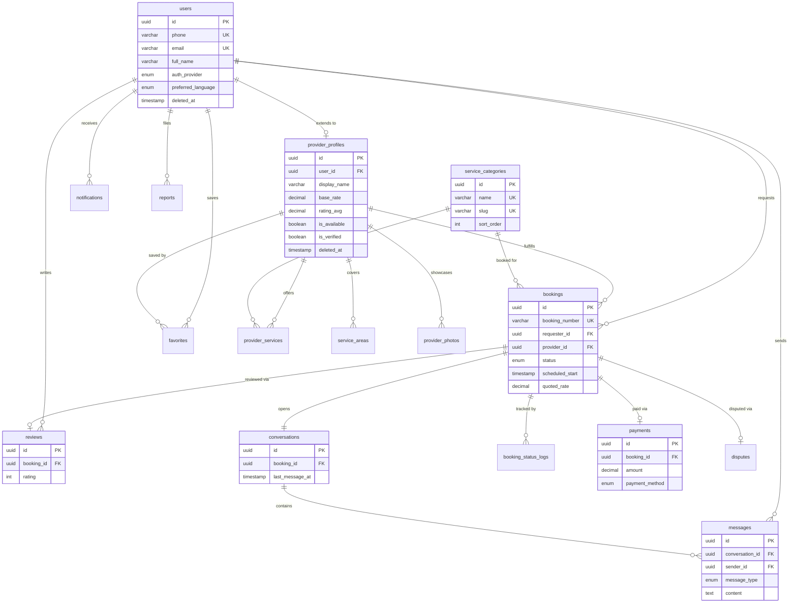

# TownHelp database schema

> Version 1.0.0 | Last updated: 2026-03-22
> 16 tables | 14 enums | 13 indexes | 10 check constraints

## Entity relationship diagram



## Table reference

### Core tables

| Table | Purpose | Soft delete |
|-------|---------|:-----------:|
| `users` | Every person who signs up. No role field — roles emerge from relationships. | Yes |
| `provider_profiles` | Extension for users who offer services. One-to-one with users. | Yes |
| `service_categories` | The 6 launch categories. Reference/seed data. | No |
| `provider_services` | Junction: which providers offer which services. | No |
| `service_areas` | Where providers operate. Supports geo-based filtering. | No |
| `provider_photos` | Provider work samples and portfolio images. | No |

### Operations tables

| Table | Purpose | Soft delete |
|-------|---------|:-----------:|
| `bookings` | Core transaction. Human-readable booking_number (TH-YYMMDD-NNN). | No |
| `booking_status_logs` | Audit trail: every state transition with who/when/why. | No |
| `conversations` | One per booking. last_message_at for efficient sorting. | No |
| `messages` | Chat messages. Highest write-volume table. | No |

### Trust & safety tables

| Table | Purpose | Soft delete |
|-------|---------|:-----------:|
| `reviews` | Post-booking feedback. Both parties can review each other. | No |
| `disputes` | Booking-level disputes (no-show, overcharge, etc.) | No |
| `reports` | User-level reports (harassment, fraud, fake profile). | No |

### Commerce & engagement tables

| Table | Purpose | Soft delete |
|-------|---------|:-----------:|
| `payments` | One per booking. Idempotency key prevents double charges. | No |
| `notifications` | Multi-channel: in-app, SMS, WhatsApp, push. | No |
| `favorites` | Requesters saving providers for quick re-booking. | No |

## Enums

| Enum | Values | Used by |
|------|--------|---------|
| `AuthProvider` | PHONE, GOOGLE | users |
| `PreferredLanguage` | ENGLISH, TELUGU, HINDI | users |
| `RateType` | HOURLY, PER_VISIT, FIXED, PER_KG | provider_profiles, provider_services |
| `BookingStatus` | PENDING, CONFIRMED, IN_PROGRESS, COMPLETED, CANCELLED, DISPUTED | bookings, booking_status_logs |
| `MessageType` | TEXT, IMAGE, LOCATION, SYSTEM | messages |
| `PaymentStatus` | PENDING, COMPLETED, FAILED, REFUNDED | payments |
| `PaymentMethod` | CASH, UPI, CARD, WALLET | payments |
| `Currency` | INR | payments |
| `NotificationChannel` | IN_APP, SMS, WHATSAPP, PUSH | notifications |
| `NotificationType` | BOOKING_REQUEST, BOOKING_CONFIRMED, BOOKING_CANCELLED, MESSAGE_NEW, REVIEW_RECEIVED, PAYMENT_RECEIVED, DISPUTE_OPENED, DISPUTE_RESOLVED, SYSTEM | notifications |
| `DisputeReason` | NO_SHOW, POOR_QUALITY, OVERCHARGED, INAPPROPRIATE, PROPERTY_DAMAGE, OTHER | disputes |
| `DisputeStatus` | OPEN, UNDER_REVIEW, RESOLVED, DISMISSED | disputes |
| `ReportReason` | HARASSMENT, FRAUD, FAKE_PROFILE, INAPPROPRIATE, SPAM, OTHER | reports |
| `ReportStatus` | OPEN, REVIEWING, ACTION_TAKEN, DISMISSED | reports |

## Indexes

### Provider discovery (hot path)

| Table | Columns | Purpose |
|-------|---------|---------|
| `provider_profiles` | (is_available, is_verified, rating_avg DESC) | Sort by best available |
| `provider_services` | (category_id, is_active) | Filter by service category |
| `service_areas` | (provider_id, area_name) | Filter by neighborhood |

### User dashboards

| Table | Columns | Purpose |
|-------|---------|---------|
| `bookings` | (requester_id, status, created_at DESC) | Requester booking list |
| `bookings` | (provider_id, status, created_at DESC) | Provider booking list |

### Chat

| Table | Columns | Purpose |
|-------|---------|---------|
| `messages` | (conversation_id, created_at DESC) | Chat pagination |
| `conversations` | (requester_id, last_message_at DESC) | Requester chat list |
| `conversations` | (provider_id, last_message_at DESC) | Provider chat list |

### Other

| Table | Columns | Purpose |
|-------|---------|---------|
| `booking_status_logs` | (booking_id, created_at) | Audit trail per booking |
| `reviews` | (reviewee_id, created_at DESC) | Provider review list |
| `notifications` | (user_id, is_read, created_at DESC) | Notification feed |
| `users` | (deleted_at) | Soft delete filter |
| `provider_profiles` | (deleted_at) | Soft delete filter |

## Check constraints

> **Note:** Prisma does not natively support CHECK constraints. These must be
> added via a raw SQL migration (`prisma migrate dev --create-only` then edit
> the SQL). They are documented here as the intended data integrity rules.

| Table | Constraint | Rationale |
|-------|-----------|-----------|
| `reviews` | reviewer_id != reviewee_id | Prevent self-reviews |
| `reviews` | rating BETWEEN 1 AND 5 | Valid star rating range |
| `bookings` | requester_id != provider_id | Cannot book yourself |
| `bookings` | scheduled_end > scheduled_start | Valid time range |
| `bookings` | quoted_rate >= 0, final_amount >= 0 | Non-negative money |
| `payments` | amount > 0 | Positive payment amount |
| `provider_profiles` | base_rate >= 0 | Non-negative rate |
| `provider_profiles` | available_to > available_from | Valid time range |
| `reports` | reporter_id != reported_user_id | Cannot report yourself |
| `users` | failed_login_attempts >= 0 | Non-negative counter |

## Unique constraints

| Table | Columns | Purpose |
|-------|---------|---------|
| `provider_services` | (provider_id, category_id) | One listing per category per provider |
| `favorites` | (user_id, provider_id) | No duplicate favorites |
| `reviews` | booking_id (single column unique) | One review per booking |
| `provider_profiles` | user_id (single column unique) | One profile per user |
| `conversations` | booking_id (single column unique) | One conversation per booking |
| `payments` | booking_id (single column unique) | One payment per booking |
| `disputes` | booking_id (single column unique) | One dispute per booking |

## Seed data

The `service_categories` table is pre-populated with 6 launch categories:

| Slug | Name | Icon | Sort |
|------|------|------|:----:|
| `maid` | Maid / Cleaning | spray-can | 1 |
| `cook` | Cook / Tiffin | chef-hat | 2 |
| `electrician` | Electrician / Plumber | wrench | 3 |
| `dhobi` | Dhobi / Laundry | shirt | 4 |
| `tutor` | Tutoring | book-open | 5 |
| `pickup-drop` | Pickup / Drop | car | 6 |

## Booking lifecycle

```
PENDING → CONFIRMED → IN_PROGRESS → COMPLETED
   ↓          ↓            ↓              ↓
CANCELLED  CANCELLED    DISPUTED ←────────┘
                            ↓
                      RESOLVED / CANCELLED
```

Every transition is logged in `booking_status_logs` with the user who triggered it, the previous status, the new status, and an optional note.

## RLS ownership paths

Every table traces back to `users.id` for Supabase Row Level Security:

| Table | Ownership path |
|-------|---------------|
| `users` | Self (id) |
| `provider_profiles` | user_id → users.id |
| `provider_services` | provider_id → provider_profiles.user_id |
| `service_areas` | provider_id → provider_profiles.user_id |
| `provider_photos` | provider_id → provider_profiles.user_id |
| `bookings` | requester_id OR provider_id |
| `booking_status_logs` | booking_id → bookings.(requester_id OR provider_id) |
| `conversations` | requester_id OR provider_id |
| `messages` | sender_id OR conversation participant |
| `reviews` | reviewer_id (write), public (read) |
| `disputes` | raised_by OR booking participant |
| `reports` | reporter_id (write), admin only (read) |
| `payments` | booking_id → bookings.(requester_id OR provider_id) |
| `notifications` | user_id |
| `favorites` | user_id |

## Architectural decisions

### Why single User table + ProviderProfile extension?

A user can be both requester and provider. Locking into a role field forces dual accounts. The extension pattern adds capabilities without bloating the core table. Adding new user types (admin, moderator) requires no schema change.

### Why Conversation separate from Message?

Querying "my recent conversations" without scanning all messages. The `last_message_at` column on conversations makes this a single indexed read instead of a GROUP BY subquery on the messages table.

### Why rating_sum instead of just rating_avg?

When a new review comes in: `rating_sum += new_rating`, `rating_count += 1`, `rating_avg = rating_sum / rating_count`. This is O(1). Without rating_sum, recalculating the average requires scanning all reviews for that provider: O(n).

### Why UUIDs not auto-increment?

Cannot enumerate other users by guessing IDs (security). Work natively with Supabase `gen_random_uuid()`. No coordination needed if we ever shard the database.

### Why JSONB for metadata fields?

Different message types need different metadata (image URL vs location coordinates vs system event data). JSONB avoids 20 nullable columns, is indexed and queryable in PostgreSQL, and adapts to future requirements without migrations.

## Phase 2 deferred items

These were identified during review but deferred to keep MVP focused:

1. **Column-level encryption** — Encrypt phone, email, whatsapp_number fields. Requires key management infrastructure.
2. **Complex availability slots** — Replace simple available_from/to with per-day schedule table (Mon 9-5, Tue 10-3, etc.).
3. **Recurring bookings** — Add recurrence_rule and parent_booking_id. For MVP, re-book via favorites.
4. **Full-text search vector** — Add tsvector generated column with GIN index on provider_profiles for name/bio search.
